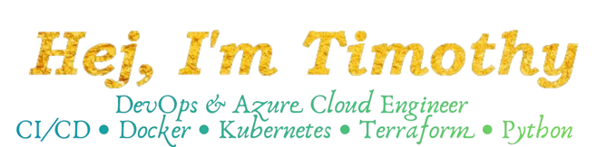

I’m a DevOps & Cloud-focused Python developer, passionate about building scalable and maintainable systems in Azure. I’ve worked on cloud infrastructure, automated deployments, and CI/CD pipelines for companies and remote teams. I focus on clean, modular, and accessible code**, and I enjoy making complex systems easy to manage and reliable for both business and consumer applications.
 
 

<table>
  <tr>
    <td>
      
    </td>
    <td>
      
    </td>
  </tr>
</table>

